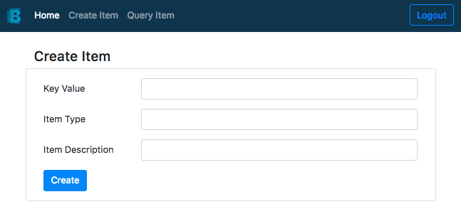
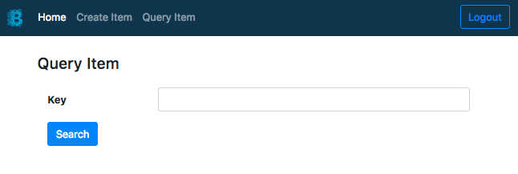

# etsit-fabric

This example demonstrates how to use and create apps with Hyperledger Fabric.

To set up this App there are two parts:
+ [Infrastructure](https://github.com/KairosDS/etsit-fabric/tree/master/etsit-fabric_infrastructure): compound by a Fabric Blockchain and an API that uses [Fabric Node SDK](https://fabric-sdk-node.github.io/).
+ [Front Application](https://github.com/KairosDS/etsit-fabric/tree/master/etsit-fabric_front-app): a simple web app that send requests to our API.

Firstly, you will need to configure the infra (follow steps at the readme) and then, the front.

## Screenshots

